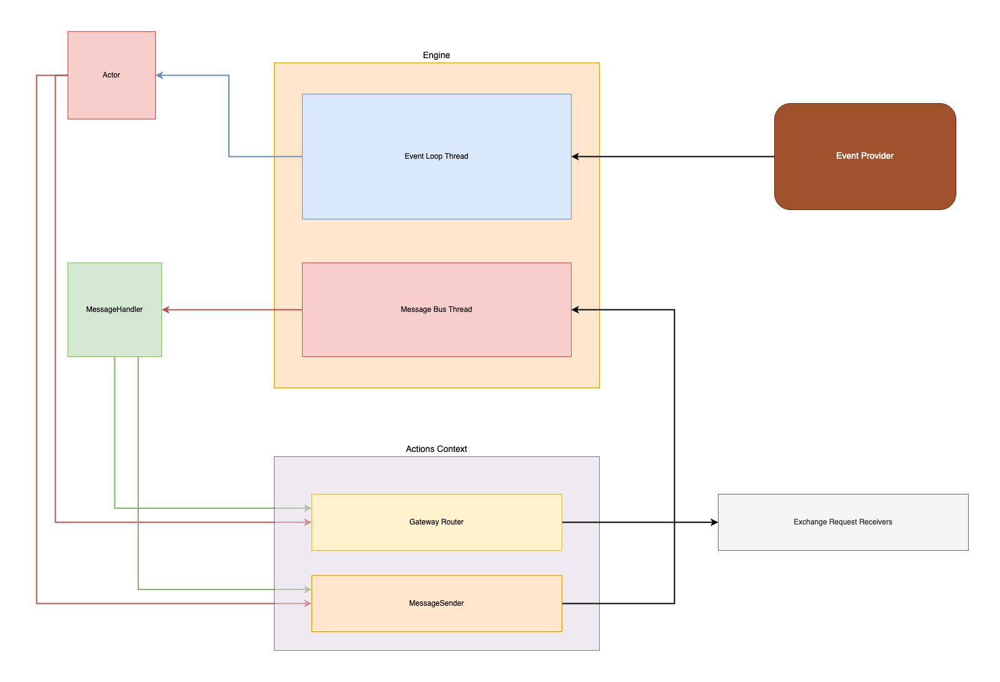
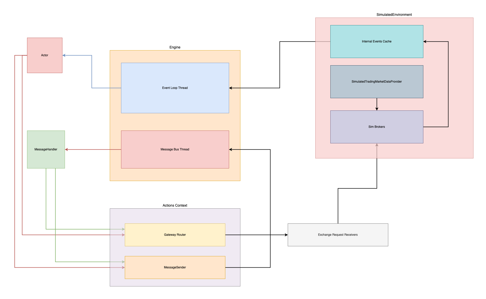
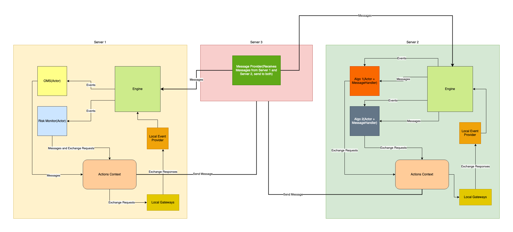

**Geger** is a framework for building algorithmic trading systems. It designed to be flexible and simple as much as possible. It doesn't have fancy technical indicators or UI, you can do it on your own. Framework is responsible for handling market data events, orders and messages and distribute them across components.

**Current state:**
* only backtesting mode with trades and quotes as a data source
* simulation supports only GTC limit orders
* unlimited number of strategies and other event handlers in single engine
* support multiple symbols and exchanges in each strategy or event handler
* wire and internal latency emulation per exchange basis
* some test coverage


## **Architecture overview**

**High Level Diagram**



**High Level Diagram For Simulation Env**



### Events

First of all, it's event driven framework. It has 2 types of events:
* Exchange events or just simply **Event**, which includes trades, quotes, order updates, exchange responses. In other words it's everything that exchange(s) can send to our system. At this point of time **Event** is not customizable and can't be fired from user defined components.
```rust
#[derive(Debug, Clone, Deserialize, Serialize, PartialEq)]
pub enum Event {
    NewMarketTrade(Trade),
    NewQuote(Quote),
    ResponseNewOrderAccepted(NewOrderAccepted),
    ResponseNewOrderRejected(NewOrderRejected),
    ResponseCancelOrderAccepted(CancelOrderAccepted),
    ResponseCancelOrderRejected(CancelOrderRejected),
    UDSOrderUpdate(OrderUpdate),
}
```
* Custom events (aka **Message** trait). This type of events is used for communication between components and can be fired in system. For example, you can create Message that holds total current PnL and send this message to risk manager actor. When PnL drops below threshold actor sends orders to close all open positions.
```rust
pub trait Message: Clone + Debug {
    fn get_topic(&self) -> Option<Topic>;
    fn is_event_loop_stopped_message(&self) -> bool;
    fn new_event_loop_stopped_message() -> Self;
}
```


### Event Loop

Event loop is a heart of the framework. It has very simple role - receives events from EventProvider and distribute them across Actors.
The only thing that can be customized is EventProvider. EventProvider is a component that receives events from exchanges, caches them internally and returns most recent one when EvenLoop asks for `next_event`.
Currently, we have EventProvider implementation for simulated trading (`SimulatedEnvironment`). Event loop executes in separate thread.

### Actor

`Actor` is base brick in Geger framework. Each actor does very simple thing - it handles exchange events (`Event`). Actor can be everything: trading strategy, risk module, balance updater, OMS, slack notifier. EventLoop distributes each `Event` across all `Actors`.
```rust
pub trait Actor<M: Message, MS: MessageSender<M>>: Send {
    fn on_event(&mut self, event: &Event, actions_context: &mut ActionsContext<M, MS>);
}

```

You can add multiple actors into single EventLoop. If all actors are the same type just you can add them directly. If there are different types of `Actors` you can use enum instead. Here is example taken from [here](examples/strategy.rs):
```rust
#[derive(Debug)]
enum MyActors {
    Strategy(SampleStrategy),
}

impl<MS: MessageSender<SimpleMessage>> Actor<SimpleMessage, MS> for MyActors {
    fn on_event(&mut self, event: &Event, actions_context: &mut ActionsContext<SimpleMessage, MS>) {
        match self {
            MyActors::Strategy(s) => s.on_event(event, actions_context),
        }
    }
}
```

### Actions Context
You might notice that we pass `actions_context` into `on_event`. What is it for? Basically it's a component that allows you `Actor` communicate with exchange (via exchange requests) and other Actors (via `Message`). Actions context allows you to send and cancel orders, fire and distribute custom messages.
Here is some functions you can use:
```rust
pub fn send_order(&mut self, request: NewOrderRequest) -> Result<(), ActionError>;
pub fn cancel_order(&mut self, request: CancelOrderRequest) -> Result<(), ActionError>;
pub fn send_message(&mut self, message: M) -> Result<(), ActionError>;

```

Exchange requests that you can send to `ActionsContext`

```rust
#[derive(Clone, Debug, Deserialize, Serialize, PartialEq)]
pub enum ExchangeRequest {
    NewOrder(NewOrderRequest),
    CancelOrder(CancelOrderRequest),
}


#[derive(Clone, Debug, Deserialize, Serialize, PartialEq)]
pub struct NewOrderRequest {
    pub request_id: ExchangeRequestID,
    pub client_order_id: ClientOrderId,
    pub exchange: Exchange,
    pub r#type: OrderType,
    pub time_in_force: TimeInForce,
    pub price: Option<f64>,
    pub trigger_price: Option<f64>,
    pub symbol: Symbol,
    pub quantity: f64,
    pub side: Side,
    pub creation_ts: Timestamp,
}

#[derive(Clone, Debug, Deserialize, Serialize, PartialEq)]
pub struct CancelOrderRequest {
    pub request_id: ExchangeRequestID,
    pub client_order_id: ClientOrderId,
    pub exchange_order_id: ExchangeOrderId,
    pub exchange: Exchange,
    pub symbol: Symbol,
    pub creation_ts: Timestamp,
}
```

### Message Bus
Message bus play same role as EvenLoop but for `Message`s. It also runs on it's own thread. If you don't need messaging then you don't need MessageBus thread (see Engine section below).
Because MessageBus is much more flexible comparing to EventLoop. First of all it can work with any user defined message that implements `Message` trait:
```rust
pub trait Message: Clone + Debug {
    fn get_topic(&self) -> Option<Topic>;
    fn is_event_loop_stopped_message(&self) -> bool;
    fn new_event_loop_stopped_message() -> Self;
}
```
There are few important subcomponents:

* `MessageProvider`. It works in the same way as `EventProvider` in `EventLoop`.
```rust
pub trait MessageProvider<M: Message>: Debug {
    fn next_message(&mut self) -> Option<M>;
}
```
`MessageProvider` has built-in default implementation which is `CrossbeamMessageProvider`

* `MessageSender`. This component is responsible for sending messages into MessageBus. Basically speaking `MessageSender` should send messages to `MessageProvider`.
```rust
pub trait MessageSender<M: Message>: Debug + Clone {
    fn send_message(&mut self, message: M) -> Result<(), String>;
}
```

`MessageSender` also has built-in default implementation which is `CrossbeamMessageSender`

* `MessageHandler` it does same job as `Actor` in `EventLoop`. It handles all `Message`s based on topic.
```rust
pub trait MessageHandler<M: Message, MS: MessageSender<M>>: Debug + Send {
    fn on_new_message(&mut self, message: &M, actions_context: &ActionsContext<M, MS>);
    fn get_topics(&self) -> Vec<Topic>;
}
```


As you can see `MessageBus` depends on several traits, and it's impl might look scary or overwhelmed. Lucky us we don't need to deal with MessageBus initialization directly (see Engine section)!
```rust
impl<M: Message, T: MessageProvider<M>, H: MessageHandler<M, MS>, MS: MessageSender<M>>
    MessageBus<M, T, H, MS>;
```


### Engine
`Engine` is the entry point that allows you to create you own combination of `Actors` and `MessageHandlers`, start `EventLoop` and `MessageBus`. In other words `Engine` is not more than builder and runner combined.

There are 2 types of functions:
* Initialization functions (builder part):
```rust
pub fn add_actor(&mut self, actor: Arc<Mutex<S>>);
pub fn add_message_handler(&mut self, message_handler: Arc<Mutex<H>>);
pub fn add_exchange(&mut self, exchange: Exchange);
```

* Run functions (runner part):

Each function consumes Engine and returns `EngineExecutionInfo`.

```rust
pub fn execute_with_sim_environment<T: SimulatedTradingMarketDataProvider + Send + 'static>(
    self,
    md_provider: T,
    default_latency: Option<Latency>,
    sim_broker_configs: HashMap<Exchange, SimBrokerConfig>,
    run_messaging: bool,
) -> Result<EngineExecutionInfo, EngineError>;
pub fn start_with_event_provider<T: EventProvider + Send + 'static>(
    self,
    event_provider: T,
    run_messaging: bool,
) -> Result<EngineExecutionInfo, EngineError>;
pub fn run_with_event_provider_custom_messaging<
    T: EventProvider + Send + 'static,
    MP: MessageProvider<M> + Send + 'static,
>(
    self,
    event_provider: T,
    message_sender: MS,
    message_provider: MP,
) -> Result<EngineExecutionInfo, EngineError>;
```

#### EngineExecutionInfo
It's a struct that contains information about Engine's start threads and exchange request receivers (which can be used to connect exchange gateways to `ActionsContext`)

```rust
pub struct EngineExecutionInfo {
    pub threads: Vec<io::Result<JoinHandle<()>>>,
    pub exchange_requests_receivers: HashMap<Exchange, Receiver<ExchangeRequest>>,
}
```


## **Quick start**

To start backtesting you need to implement just 2 things:
* you strategy (Actor) or enum implementing Actor interface in case you have multiple Actors
* market data provider, to feed Quotes/Trades from DB or disk into system

```rust
pub trait SimulatedTradingMarketDataProvider {
    fn next_event(&mut self) -> Option<MarketDataEvent>;
}
```

There are few important things need to be said about Actor and MessageHandler:
* When we add our `Actor` into `Engine` we need to wrap it into `Arc<Mutex<T>>`
* When we add our `MessageHandler` into `Engine` we need to wrap it into `Arc<Mutex<T>>`
* Single struct can implement both `Actor` and `MessageHandler`, that's why we need Mutex around it. (MessageBus and EventLoop are running in separate threads)
* You need to manage running Engine threads on your own (execution_info.threads)!

The best way to run you strategy is `Engine`. Here is example how we can add our strategy as `Actor` and as `MessageHandler` into Engine and run exectuion:
```rust
let mut engine = Engine::new();

    let mut sim_broker_configs = HashMap::new();
    sim_broker_configs.insert(SIM_BROKER_EXCHANGE.to_string(), SimBrokerConfig::default());

    let strategy = Arc::new(Mutex::new(MyActors::Strategy(SampleStrategy::new())));
    engine.add_actor(strategy.clone());
    engine.add_message_handler(strategy.clone());
    engine.add_exchange(SIM_BROKER_EXCHANGE.to_string());

    let execution_info = engine
        .execute_with_sim_environment(md_provider, None, sim_broker_configs, true)
        .unwrap();

    for th in execution_info.threads {
        th.unwrap().join().unwrap()
    }
```

see full example strategy [here](examples/strategy.rs)


Here is example of distributed trading system made with  **Geger** framework:




## Disclaimer
You will use this code on your own risk!

I EXPRESSLY DISCLAIMS ALL REPRESENTATIONS AND WARRANTIES, EXPRESS OR IMPLIED, WITH RESPECT TO THE CODE, INCLUDING THE WARRANTIES OF MERCHANTABILITY AND OF FITNESS FOR A PARTICULAR PURPOSE. UNDER NO CIRCUMSTANCES INCLUDING NEGLIGENCE SHALL I BE LIABLE FOR ANY DAMAGES, INCIDENTAL, SPECIAL, CONSEQUENTIAL OR OTHERWISE (INCLUDING WITHOUT LIMITATION DAMAGES FOR LOSS OF PROFITS, BUSINESS INTERRUPTION, LOSS OF INFORMATION OR OTHER PECUNIARY LOSS) THAT MAY RESULT FROM THE USE OF OR INABILITY TO USE THE CODE, EVEN IF I HAS BEEN ADVISED OF THE POSSIBILITY OF SUCH DAMAGES.
